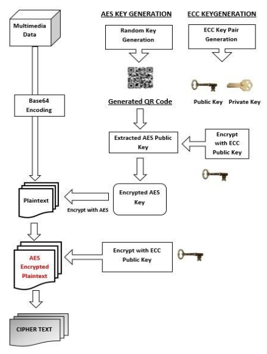

# Hybrid-Cryptography

#### This repository contains an implemntaion of this [Paper](https://pdfs.semanticscholar.org/496c/3aa8c731e93deac7a5ad3b1fbd4dd264b11a.pdf)

## Abstract
This  paper  mainly focusses   on   the   implementation   of   a   system   capable   of encryption  and  decryption  of  multimedia  data  (Text,  Images, Videos,  Audio  etc.)  using  a  hybrid  model  based  on  the amalgamation  of  symmetric  encryption  techniques  such  as AES and  asymmetric  techniques  such  as  ECC.

## Implementation
The encryption process occurs as follows, and the decryption process is the reverse of the same.

## Enigma
This is an apllication made using Django and NodeJs, which is based on encryption and decryption process mentioned in the paper.

### Run the Django application in virtual environment inside Enigma directory
`python manage.py runserver`

### Also run the node.js server from Enigma/nodejs
`node index.js`

### So this is what you need to do after both servers are live:
* Open 2 browser tabs. 
* Enter the sender and receiver nickname in each of the respective tabs.
* Now work with the sender side first, click send
* Enter the exact nickname of the receiver in the form.
(The receivers public key should automatically show up, also the send button would show up. If not, then re run from step 1)  
* Now work with the receiver side, click receive, enter the ecc private key of the receiver and click receive button.
(It converts the private key to public key and sends the ecc public key of that receiver to the nodejs server)
(The receivers public key should automatically show up on the sender's tab, also the send button would show up. If not, then re run from step 1)
* Enter the AES private key, upload your file and send.

The rest of the things will be handled by the servers. And the download link of the decrypted file will be available on the receiver side with appropriate alerts.

## Team Members
* [Dhvanil Parikh](https://github.com/dhvanilp), 16IT217
* [Shreyas Shankar](https://github.com/shrey920), 16IT138
